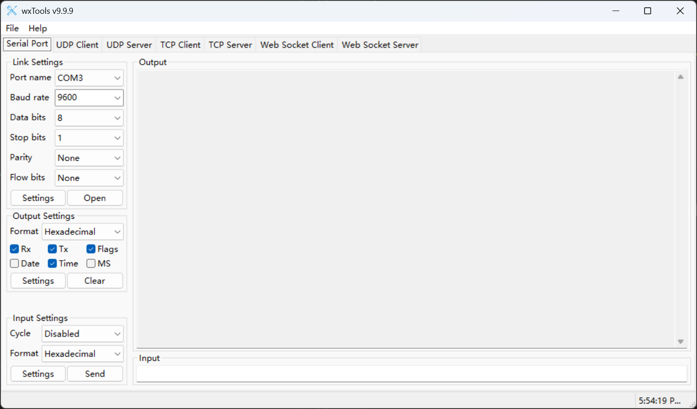
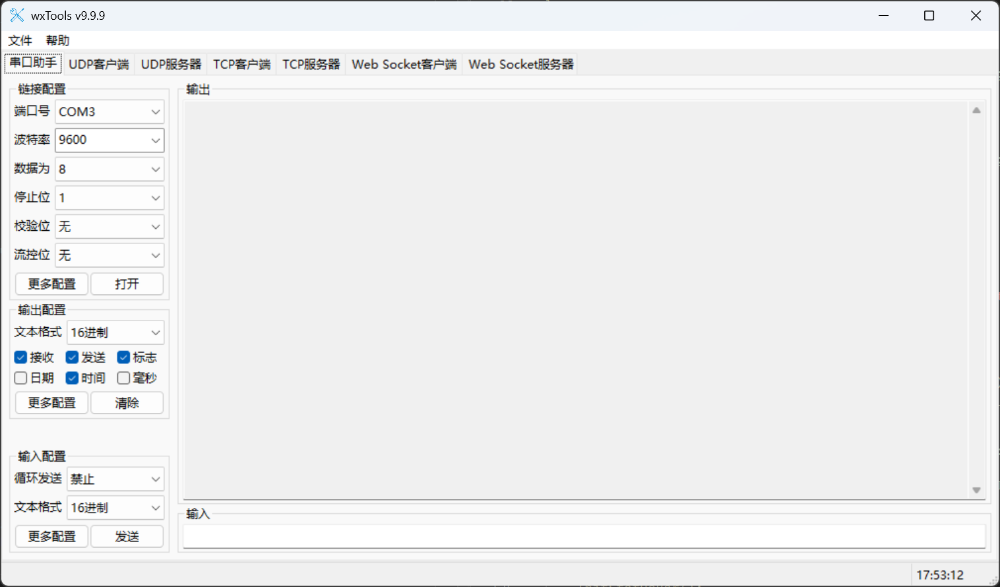

# wxTools  

wxTools is a user-friendly, open-source, cross-platform debugging tool-set based on wxWidgets (wxWidgets 3.2.x is recommended). It offers extensive support for SerialPort, UDP, TCP and Web Socket debugging functionalities.

> **You can get *wxTools* form [Micorsoft Store(Sponsor)](https://www.microsoft.com/store/apps/9P29H1NDNKBB)** or from [Github Release(community)](https://github.com/x-tools-author/wx-tools/releases).

## About the Project

<!--https://sdpro.top/blog/html/article/1016.html-->

|Option|Description|
|---|---|
|Author|x-tools-author|
|E-mail|<x-tools@outlook.com>|
|User Communication| 952218522 (QQ Group)|
|Gitee| <https://gitee.com/x-tools-author/x-tools>|
|GitHub| <https://github.com/x-tools-author/x-tools>|
|Sponsor|<https://apps.microsoft.com/search/publisher?name=x-tools-author>|
|Third party|[glog](https://github.com/google/glog) [asio](https://github.com/boostorg/asio) [fmt](https://github.com/fmtlib/fmt) [json](https://github.com/nlohmann/json) [libcrc](https://github.com/lammertb/libcrc) [sigslot](https://github.com/palacaze/sigslot) [mongoose]( https://github.com/cesanta/mongoose) [CSerialPort](https://github.com/itas109/CSerialPort)|
